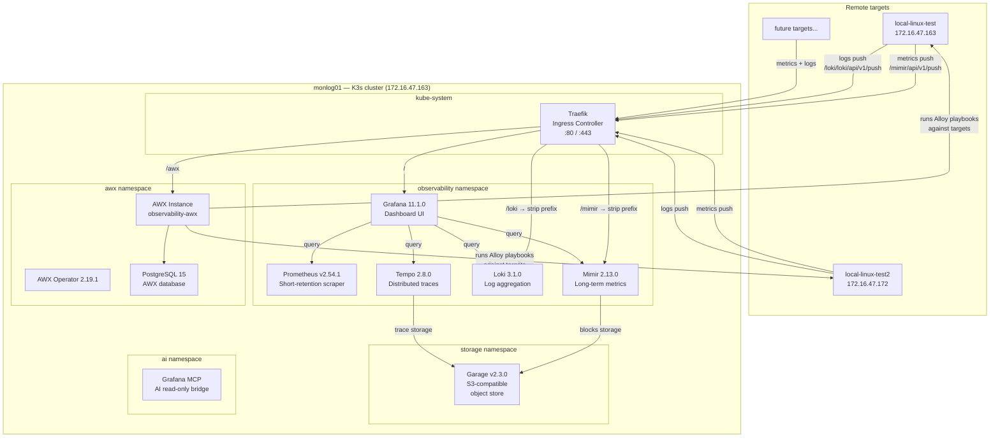
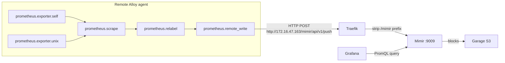
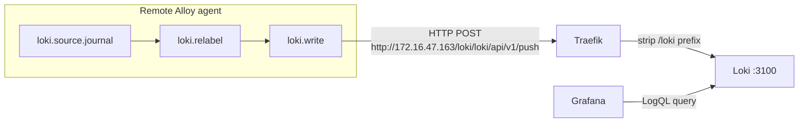
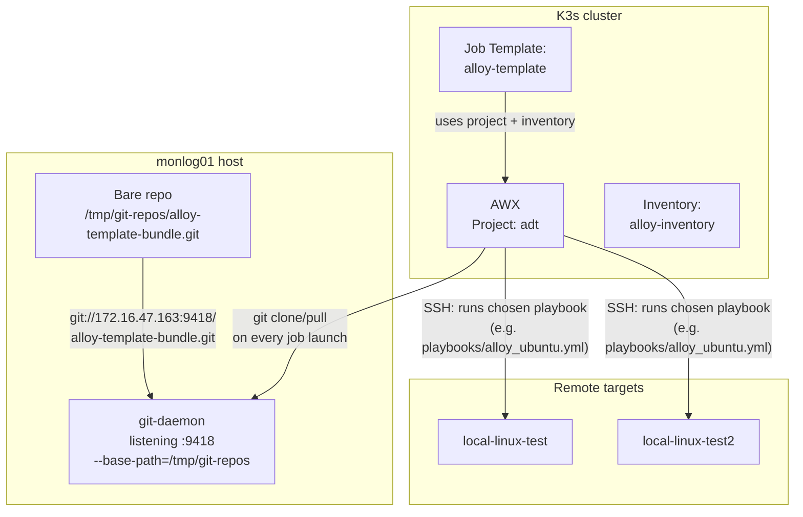

# LGTM Observability Stack — Operations Guide

This document is the complete reference for the LGTM observability stack running on K3s. It covers the architecture, every component, how data flows through the system, and how to perform common operational tasks.

Host: **monlog01** (172.16.47.163) — Ubuntu 24.04 LTS, K3s v1.36.3+k3s1 single-node cluster.

---

## 1. Architecture overview

The stack runs entirely on a single K3s node. All user-facing traffic enters through the Traefik ingress controller on port 80. Internal services communicate over ClusterIP.



## 2. Namespace layout

| Namespace      | Purpose                                              |
|---------------|------------------------------------------------------|
| kube-system   | K3s core: Traefik, CoreDNS, metrics-server, local-path-provisioner |
| storage       | Garage S3 object store (StatefulSet)                 |
| observability | Grafana, Prometheus, Mimir, Loki, Tempo              |
| awx           | AWX Operator, AWX instance, PostgreSQL               |
| ai            | Grafana MCP server for AI integration                |

## 3. Component details

### 3.1 Traefik ingress controller

Traefik is the default K3s ingress. All external traffic arrives at 172.16.47.163:80.

| Path     | Backend                   | Type          | Notes                          |
|----------|---------------------------|---------------|--------------------------------|
| /        | grafana:80                | Ingress       | Main dashboard UI              |
| /awx     | observability-awx-service:80 | Ingress    | AWX web console                |
| /mimir   | mimir:9009                | IngressRoute  | Mimir write endpoint (prefix stripped) |
| /loki    | loki:3100                 | IngressRoute  | Loki push endpoint (prefix stripped)   |

The `/mimir` and `/loki` routes use Traefik Middleware resources (`strip-mimir-prefix`, `strip-loki-prefix`) to strip the path prefix before forwarding to the backend.

### 3.2 Prometheus

- Image: `prom/prometheus:v2.54.1`
- Role: Short-retention local scraper (24h retention)
- Storage: 5Gi PVC (`prometheus-data`, local-path)
- Config: `prometheus-config` ConfigMap
- Scrape targets: itself (`localhost:9090`) and the Kubernetes API server
- Flags: `--storage.tsdb.retention.time=24h`, `--web.enable-lifecycle`
- Service: `prometheus:9090` (ClusterIP)

Prometheus is the local scraper for cluster-internal targets. Remote Alloy agents do NOT push to Prometheus — they push to Mimir.

### 3.3 Mimir

- Image: `grafana/mimir:2.13.0`
- Role: Long-term metrics storage (remote_write target for Alloy agents)
- Storage: 10Gi PVC (`mimir-data`, local-path) for compactor/local state
- Object storage: Garage S3 (`mimir-blocks` bucket)
- Config: `mimir-config` ConfigMap
- Service: `mimir:9009` (ClusterIP)
- External write: `http://172.16.47.163/mimir/api/v1/push` (via Traefik)
- Query: `http://mimir:9009/prometheus` (Grafana datasource)
- Single-tenant mode, replication_factor=1

### 3.4 Loki

- Image: `grafana/loki:3.1.0`
- Role: Log aggregation
- Storage: 10Gi PVC (`loki-data`, local-path) — filesystem backend, no S3
- Config: `loki-config` ConfigMap
- Retention: 168h (7 days)
- Schema: TSDB v13
- Service: `loki:3100` (ClusterIP)
- External push: `http://172.16.47.163/loki/loki/api/v1/push` (via Traefik)

### 3.5 Tempo

- Image: `grafana/tempo:2.8.0`
- Role: Distributed trace storage
- Object storage: Garage S3 (`tempo` bucket)
- Receivers: OTLP gRPC (:4317) and HTTP (:4318)
- Service: `tempo:3200` (ClusterIP), plus gRPC/OTLP ports

### 3.6 Grafana

- Image: `grafana/grafana:11.1.0`
- Storage: 2Gi PVC (`grafana-data`, local-path)
- Access: `http://172.16.47.163/` (via Traefik Ingress)
- Credentials: admin / admin
- Datasources (provisioned via ConfigMap):

| Name       | UID         | Type       | Internal URL                    | Default |
|-----------|-------------|------------|----------------------------------|---------|
| Prometheus | prometheus | prometheus | http://prometheus:9090           | Yes     |
| Mimir      | mimir      | prometheus | http://mimir:9009/prometheus     | No      |
| Loki       | loki       | loki       | http://loki:3100                 | No      |
| Tempo      | tempo      | tempo      | http://tempo:3200                | No      |

**Important:** When viewing dashboards that query Alloy fleet data (e.g. Alloy Fleet Overview), select the **Mimir** datasource, not Prometheus. Alloy agents push metrics to Mimir.

### 3.7 Garage (S3 object store)

- Image: `dxflrs/garage:v2.3.0`
- Type: StatefulSet
- Storage: 50Gi data PVC + 2Gi metadata PVC (local-path)
- Service: `garage.storage.svc.cluster.local`
- Ports: 3900 (S3 API), 3901 (RPC), 3902 (Web), 3903 (Admin)
- Replication factor: 1
- Buckets: `mimir-blocks` (Mimir), `tempo` (Tempo)

### 3.8 AWX

- Operator: `quay.io/ansible/awx-operator:2.19.1`
- Instance: `observability-awx`
- Database: PostgreSQL 15 (8Gi PVC)
- Access: `http://172.16.47.163/awx`
- Admin password: stored in secret `observability-awx-admin-password` in the `awx` namespace

Retrieve the admin password:

```bash
kubectl get secret -n awx observability-awx-admin-password \
  -o jsonpath='{.data.password}' | base64 -d
```

### 3.9 Grafana MCP (AI integration)

- Image: `grafana/mcp-grafana:1.1.0`
- Namespace: ai
- Service: `grafana-mcp:8000` (ClusterIP)
- Purpose: Read-only MCP bridge for AI assistants to query Grafana datasources
- Auth: `grafana-mcp-auth` secret

## 4. Persistent storage summary

All persistent volumes use the K3s `local-path` storage class (node-local storage).

| Claim                | Namespace      | Size  | Purpose                |
|---------------------|----------------|-------|------------------------|
| prometheus-data      | observability  | 5Gi   | Prometheus TSDB        |
| mimir-data           | observability  | 10Gi  | Mimir compactor/state  |
| loki-data            | observability  | 10Gi  | Loki chunks and index  |
| tempo-data           | observability  | 10Gi  | Tempo local state      |
| grafana-data         | observability  | 2Gi   | Grafana dashboards/DB  |
| data-garage-0        | storage        | 50Gi  | Garage S3 data         |
| meta-garage-0        | storage        | 2Gi   | Garage metadata        |
| postgres-15-*        | awx            | 8Gi   | AWX PostgreSQL data    |

---

## 5. Data flow

### 5.1 Metrics flow



### 5.2 Logs flow



### 5.3 Alloy agent pipeline on each target

Each Alloy agent runs from `/etc/imagine/alloy/` with modular config files:

| File                                  | Component                     | Purpose                          |
|---------------------------------------|-------------------------------|----------------------------------|
| instance.name                         | —                             | Hostname label value             |
| product.name                          | —                             | Product label value              |
| local.file.instance.alloy             | local.file                    | Reads instance.name into a var   |
| prometheus.exporter.self.alloy        | prometheus.exporter.self      | Alloy self-monitoring metrics    |
| prometheus.exporter.unix.generic.alloy| prometheus.exporter.unix      | Node-level OS metrics            |
| prometheus.relabel.alloy              | prometheus.relabel            | Adds instance/product labels, drops noise |
| prometheus.remote_write.alloy         | prometheus.remote_write       | Pushes metrics to Mimir          |
| loki.relabel.alloy                    | loki.relabel                  | Adds instance/product labels     |
| loki.write.alloy                      | loki.write                    | Pushes logs to Loki              |
| loki.source.journal.generic.alloy     | loki.source.journal           | Collects systemd journal logs    |
| logging.alloy                         | logging                       | Alloy's own log level            |

**Note:** The `loki.source.journal.generic.alloy` file is only deployed if `loki.source.journal.generic` is listed in the `alloy_components` variable. See ticket 06 for the current status of this issue.

---

## 6. AWX and the local git system

### 6.1 How it works

AWX does not pull playbooks from GitHub or any external source. Instead, a **local bare git repository** on monlog01 serves as the project source via the `git://` protocol.



### 6.2 The components

**Git daemon** — A `git-daemon` process runs on the host (not in K3s), serving bare repos from `/tmp/git-repos/` on port 9418. It is a lightweight, unauthenticated, read-only server.

```
/usr/lib/git-core/git-daemon --reuseaddr --base-path=/tmp/git-repos \
  --export-all --listen=0.0.0.0 --port=9418 /tmp/git-repos
```

**Bare repository** — The Alloy bundle lives at `/tmp/git-repos/alloy-template-bundle.git`. This is the single source of truth for all Alloy playbooks and templates.

**AWX project** — The AWX project named `adt` is configured with:
- SCM URL: `git://172.16.47.163:9418/alloy-template-bundle.git`
- Branch: `main`
- SCM update on launch: **enabled** (every job run pulls the latest commit)
- SCM clean: **enabled** (removes local changes before pull)

### 6.3 Updating the bundle

To update playbooks or templates:

```bash
# Clone a working copy
cd /tmp
git clone git://172.16.47.163:9418/alloy-template-bundle.git
cd alloy-template-bundle

# Make changes...
# e.g. edit templates/alloy/loki.source.journal.generic.alloy.j2

# Commit
git config user.email "deploy@localhost"
git config user.name "Deploy"
git add -A
git commit -m "Description of change"

# Push back to the bare repo
git remote set-url origin /tmp/git-repos/alloy-template-bundle.git
git push origin main
```

The next AWX job launch will automatically pull the updated commit because `scm_update_on_launch` is enabled.

### 6.3a Script-only bundle import when the source repo is `product-observavility`

On monlog4 the bundle source may live in a git repo at `/home/imagine/product-observavility` rather than in `~/observability-stack/alloy-bundle`.
In that case the bare repo used by AWX must be populated from the product repo before seeding AWX:

```bash
bash ~/observability-stack/scripts/deploy/06-setup-alloy-repo.sh \
  ~/observability-stack \
  /home/imagine/product-observavility

bash ~/observability-stack/scripts/deploy/05-seed-awx.sh
```

`05-seed-awx.sh` now also:
- falls back to `sudo k3s kubectl` if the calling user cannot read the K3s kubeconfig directly
- auto-detects the deployment playbook from `/tmp/git-repos/alloy-template-bundle.git`
- prefers `playbooks/alloy_ubuntu.yml` when `playbooks/alloy-deploy.yml` is not present

`06-setup-alloy-repo.sh` now supports this directly:
- optional second arg = explicit bundle source path
- default source = `REPO_DIR/alloy-bundle`
- fallback sources = `~/product-observavility`, then `~/product-observability`
- when the source is a git repo, it pushes the current HEAD into `/tmp/git-repos/alloy-template-bundle.git` as branch `main` and sets the bare repo HEAD to `main`

Equivalent manual commands, if needed:

```bash
cd /home/imagine/product-observavility
git push /tmp/git-repos/alloy-template-bundle.git HEAD:refs/heads/main
git --git-dir=/tmp/git-repos/alloy-template-bundle.git symbolic-ref HEAD refs/heads/main
```

### 6.4 Re-running the bootstrap script

The bootstrap script (`scripts/bootstrap-awx-alloy.py` in this repo) creates or updates AWX objects idempotently:

```bash
# From monlog01, with kubectl access:
python3 scripts/bootstrap-awx-alloy.py
```

This ensures the `observability` organization, `adt` project, `alloy-inventory`, and `alloy-template` job template exist and are correctly wired.

---

## 7. AWX — current objects

### 7.1 Organization

| Name    | ID |
|---------|----|
| observability | 2  |

### 7.2 Project

| Name | SCM URL | Branch | Update on launch |
|------|---------|--------|------------------|
| adt  | git://172.16.47.163:9418/alloy-template-bundle.git | main | Yes |

### 7.3 Inventory: alloy-inventory

Inventory-level variables:

```yaml
mon_fqdn: 172.16.47.163
repo_endpoint: http://172.16.47.163
prometheus_endpoint: http://172.16.47.163:9090
loki_endpoint: http://172.16.47.163:3100
```

**Note:** The `prometheus_endpoint` and `loki_endpoint` variables still reference the direct service ports. Ticket 06 tracks updating these to the ingress endpoints (`/mimir` and `/loki`).

### 7.4 Hosts

| Name              | IP             | Notes                     |
|-------------------|----------------|---------------------------|
| local-linux-test  | 172.16.47.163  | First test target (monlog01 itself) |
| local-linux-test2 | 172.16.47.172  | Second test target (monlog2)        |
| demo_basic        | 1.2.3.4        | Placeholder template      |
| demo_win_basic    | 1.2.3.4        | Windows placeholder       |
| demo_snp_exporter | 1.2.3.4        | SNP exporter placeholder  |
| demo_snmp_exporter| 1.2.3.4        | SNMP exporter placeholder |
| demo_versio       | 1.2.3.4        | Versio placeholder        |
| demo_mon          | 172.16.47.163  | Monitoring placeholder    |

### 7.5 Credentials

| Name              | Type    | Purpose                          |
|-------------------|---------|----------------------------------|
| local-linux-test  | Machine | SSH credential for Linux targets |
| windows-machines  | Machine | WinRM credential for Windows     |

### 7.6 Job template: alloy-template

- Playbook: auto-detected from the bundle, typically `playbooks/alloy_ubuntu.yml` on monlog4
- Prompts on launch: inventory, credentials, variables, limit
- Extra vars: `{"confirm_run": "yes"}`

### 7.7 Inventory groups

Groups define product types. Each group maps to a set of `alloy_components` that determines which Alloy config templates are deployed. Key groups:

| Group               | Purpose                                    |
|---------------------|--------------------------------------------|
| basic               | Minimal Linux: node exporter + self-monitoring |
| adcserver           | ADC Server endpoints                       |
| nexio               | Nexio server endpoints                     |
| motion              | Motion endpoints                           |
| creationstation     | Creation Station endpoints                 |
| docker_basic        | Docker host with basic monitoring          |
| docker_fullstack    | Full Docker monitoring stack               |
| iox                 | IOX storage endpoints                      |
| mon_core            | Monitoring infrastructure itself           |

---

## 8. Operational procedures

### 8.1 Access Grafana

Open a browser to:

```
http://172.16.47.163/
```

Login: **admin** / **admin**

### 8.2 Access AWX

```
http://172.16.47.163/awx
```

Retrieve the admin password:

```bash
kubectl get secret -n awx observability-awx-admin-password \
  -o jsonpath='{.data.password}' | base64 -d
```

### 8.3 Add a new Linux host and deploy Alloy via AWX

1. **In AWX** (http://172.16.47.163/awx):
   - Go to **Resources → Inventories → alloy-inventory → Hosts → Add**
   - Set the hostname (e.g. `new-host-01`)
   - Set host variables:
     ```yaml
     ansible_host: <IP address>
     ```
   - Save

2. **Add the host to a group** (determines which Alloy components are deployed):
   - Go to the host → **Groups** tab → **Associate**
   - Select `basic` (for standard Linux monitoring) or the appropriate product group

3. **Ensure credentials exist**:
   - Go to **Resources → Credentials**
   - If no SSH credential exists for this target, create one:
     - Type: Machine
     - Username + password or SSH key

4. **Launch the job**:
   - Go to **Resources → Templates → alloy-template → Launch**
   - Select inventory: `alloy-inventory`
   - Select credential: the SSH credential for this target
   - Limit: `new-host-01` (to run against only this host)
   - Set extra variables if needed (e.g. `alloy_components` override)
   - Launch

5. **Verify**:
   - Wait 2-3 minutes for data to arrive
   - In Grafana → Explore → select **Mimir** datasource
   - Query: `alloy_build_info{instance="new-host-01"}`
   - If the host appears, Alloy is running and pushing metrics

### 8.4 Check metrics from a deployed host

In Grafana (http://172.16.47.163/), go to **Explore** and select the **Mimir** datasource.

```promql
# See all Alloy agents reporting
alloy_build_info

# Node CPU usage for a specific host
rate(node_cpu_seconds_total{instance="local-linux-test2", mode!="idle"}[5m])

# Memory usage
node_memory_MemAvailable_bytes{instance="local-linux-test2"}

# All metrics from a specific host
{instance="local-linux-test2"}
```

For the **Alloy Fleet Overview** dashboard:
- Navigate to Dashboards → Alloy Fleet Overview
- Ensure the datasource is set to **Mimir** (not Prometheus)

### 8.5 Check logs from a deployed host

In Grafana, go to **Explore** and select the **Loki** datasource.

```logql
# All logs from a specific host
{instance="local-linux-test2"}

# Filter by systemd unit
{instance="local-linux-test2", unit="sshd.service"}

# Search for errors
{instance="local-linux-test2"} |= "error"

# Filter by severity
{instance="local-linux-test2", level="err"}

# Journal logs with dotted label names (use backticks)
{instance="local-linux-test2", `loki.source.journal.generic`=~".+"}
```

**Note:** Logs will only appear if the `loki.source.journal.generic` component is deployed on the target. See ticket 06.

### 8.6 Add a new playbook/template to the Alloy bundle

1. **Clone the bundle** on monlog01:

   ```bash
   cd /tmp
   git clone git://172.16.47.163:9418/alloy-template-bundle.git
   cd alloy-template-bundle
   ```

2. **Create the template** in `templates/alloy/`:

   Templates use Jinja2 and are named after the Alloy component they configure. For example, to add a new Loki file source:

   ```bash
   # templates/alloy/loki.source.file.myapp.alloy.j2
   ```

   The template should follow the existing pattern — forward to `loki.relabel.observe.receiver` for log sources, or `prometheus.relabel.observe.receiver` for metric sources.

3. **Register the component** in `vars/main.yml`:

   Each inventory group has a list of components. Add your new component to the appropriate group's list, or to a new group.

4. **Update the task logic** if needed:

   The main task file (`tasks/main.yml`) iterates over `alloy_components` and deploys the matching template. If your template follows the naming convention `<component-name>.alloy.j2`, it should be picked up automatically.

5. **Commit and push**:

   ```bash
   git config user.email "deploy@localhost"
   git config user.name "Deploy"
   git add -A
   git commit -m "Add loki.source.file.myapp template"
   git remote set-url origin /tmp/git-repos/alloy-template-bundle.git
   git push origin main
   ```

6. **Re-run the AWX job** against the target hosts that need the new component.

### 8.7 Check cluster health

```bash
# SSH to monlog01
ssh <user>@<mon-host>

# Node and pod status
kubectl get nodes
kubectl get pods -A

# Check specific component logs
kubectl logs -n observability deploy/grafana --tail=20
kubectl logs -n observability deploy/mimir --tail=20
kubectl logs -n observability deploy/loki --tail=20
kubectl logs -n observability deploy/prometheus --tail=20
kubectl logs -n observability deploy/tempo --tail=20

# Check storage
kubectl get pvc -A

# Check Garage S3
kubectl exec -n storage garage-0 -- /garage status
kubectl exec -n storage garage-0 -- /garage bucket list
```

### 8.8 Restart a component

```bash
kubectl rollout restart deploy/<component> -n observability
# e.g.
kubectl rollout restart deploy/grafana -n observability
kubectl rollout restart deploy/mimir -n observability
```

---

## 9. Write endpoint reference

Remote Alloy agents push telemetry to these endpoints through the Traefik ingress:

| Signal  | Endpoint URL                                        | Backend         |
|---------|-----------------------------------------------------|-----------------|
| Metrics | `http://172.16.47.163/mimir/api/v1/push`           | Mimir :9009     |
| Logs    | `http://172.16.47.163/loki/loki/api/v1/push`       | Loki :3100      |
| Traces  | `http://172.16.47.163:4317` (OTLP gRPC)            | Tempo :4317     |
| Traces  | `http://172.16.47.163:4318` (OTLP HTTP)            | Tempo :4318     |

**Note:** Traces are not yet exposed via Traefik IngressRoute. The OTLP ports would need NodePort or additional IngressRoute configuration for remote trace ingestion.

---

## 10. Software versions

| Component     | Image                         | Version  |
|--------------|-------------------------------|----------|
| K3s          | —                             | v1.36.3+k3s1 |
| Traefik      | (bundled with K3s)            | —        |
| Grafana      | grafana/grafana               | 11.1.0   |
| Prometheus   | prom/prometheus               | v2.54.1  |
| Mimir        | grafana/mimir                 | 2.13.0   |
| Loki         | grafana/loki                  | 3.1.0    |
| Tempo        | grafana/tempo                 | 2.8.0    |
| Garage       | dxflrs/garage                 | v2.3.0   |
| AWX Operator | quay.io/ansible/awx-operator  | 2.19.1   |
| Grafana MCP  | grafana/mcp-grafana           | 1.1.0    |
| Alloy (agents) | —                           | v1.18.1  |

---

## 11. Known issues and open tickets

- **Ticket 06 — Alloy components and journal source deployment**: The `alloy_components` variable defaults to `[]`, so log source templates (e.g. `loki.source.journal.generic`) are not deployed automatically. The `prometheus.remote_write` template also needs updating to use the Mimir ingress URL instead of the direct Prometheus port.

- **Ticket 07 — Automated LGTM stack deployment scripts**: Scripts and instructions for deploying the entire stack on a fresh Ubuntu instance without AI support.
